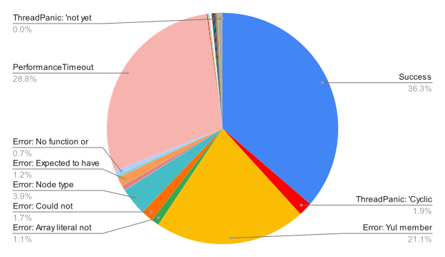

# Omniscan

Use [pyrometer](https://github.com/nascentxyz/pyrometer) to scan all of Ethereum mainnet.

Uses the Zellic [smart-contract-fiesta](https://huggingface.co/datasets/Zellic/smart-contract-fiesta) dataset snapshot as the source of smart contract code.

ATM, this is used for testing parsability of contracts to provide diagnostics for improving pyrometer. In the future this will be extended to run available detectors and analysis on the contracts to find bugs and vulnerabilities {⚪️,🧢}
## Installation

You will need a local copy of the smart-contract-fiesta dataset (large download warning, ~8GB):
```bash
git clone https://huggingface.co/datasets/Zellic/smart-contract-fiesta
```

Next, ensure you have pyrometer [installed](https://github.com/nascentxyz/pyrometer#installing) as a cli tool.


Then, run as so:
```bash
# default run is 5000 contracts, output goes to ./data/results_<timestamp>.csv, all cpu cores used, 2s timeout.
cargo run --release -- <path/to/smart-contract-fiesta>

# Configured to run 145000 contracts, 4 cpu cores used, 5s timeout.
cargo run --release -- <path/to/smart-contract-fiesta> -n 145000 -j 4 --timeout 5
```

Settings available:
```bash
Usage: omniscan [OPTIONS] <PATH>

Arguments:
  <PATH>  Path to the smart-contract-fiesta root directory

Options:
  -n, --num-contracts <NUM_CONTRACTS>
          The number of contracts to run pyrometer on. Default is 5000 If set to 0, all contracts will be analyzed
  -t, --timeout <TIMEOUT>
          Timeout for each pyrometer process (secs). Default is 2 seconds, decimals supported. If set to 0, there will be no timeout. Not advised
  -o, --output <OUTPUT>
          Where to save the results file, default is "./data/results_MM-DD_HH-MM.csv"
  -j, --jobs <JOBS>
          The number of concurrent proccesses to use for the analysis. Default is the number of cores
  -s, --skip-contracts <SKIP_CONTRACTS>
          The number of contracts to initially skip over. Default is 0. This is intended for debugging purposes
  -h, --help
          Print help
  -V, --version
          Print version
```

### Timings
These are timings I've found using my own machines.
| # Contracts | CPU | # Cores | Timeout | Time |
| ----------- | ----|------- | ------- | -------- |
| 5000        | Ryzen 5950x | 16      | 10s     |  8min     |
| 137000 (full set) | Ryzen 5950x | 16       | 10s     |  3h48min     |
| 5000 | M2 Macbook Pro | 12 | 2s |  5min14s  |

### Results

The results are saved as a csv file with the following columns:
- `bytecode_hash`: Bytecode hash of the contract, identifiable key for smart-contract-fiesta
- `result`: The result of the analysis, one of {`success`, `timeout`, `error`, `thread-panic`, `non-interpreted`}
- `time`: The time taken to analyze the contract (secs)
- `source_type`: The source type of the contract, one of {`single-file`, `multi-file`, `solc-standard-json`}

#### Pyrometer Snapshot 6/20/23
| Type	| Count	| Percent |
| ----- | ----- | ------- |
|Success | 49796 | 36.32 |
|Timeout | 39453 | 28.78 |
|Error	| 43089	| 31.43 |
|Panic	| 4625	| 3.37 |
|NonInterpreted	| 125 | 0.09 |

